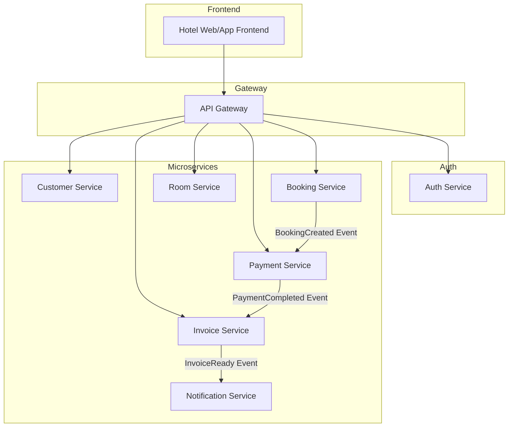
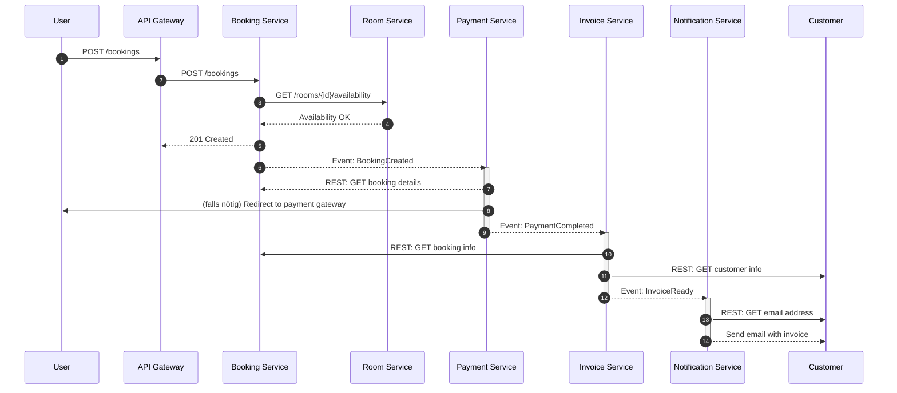
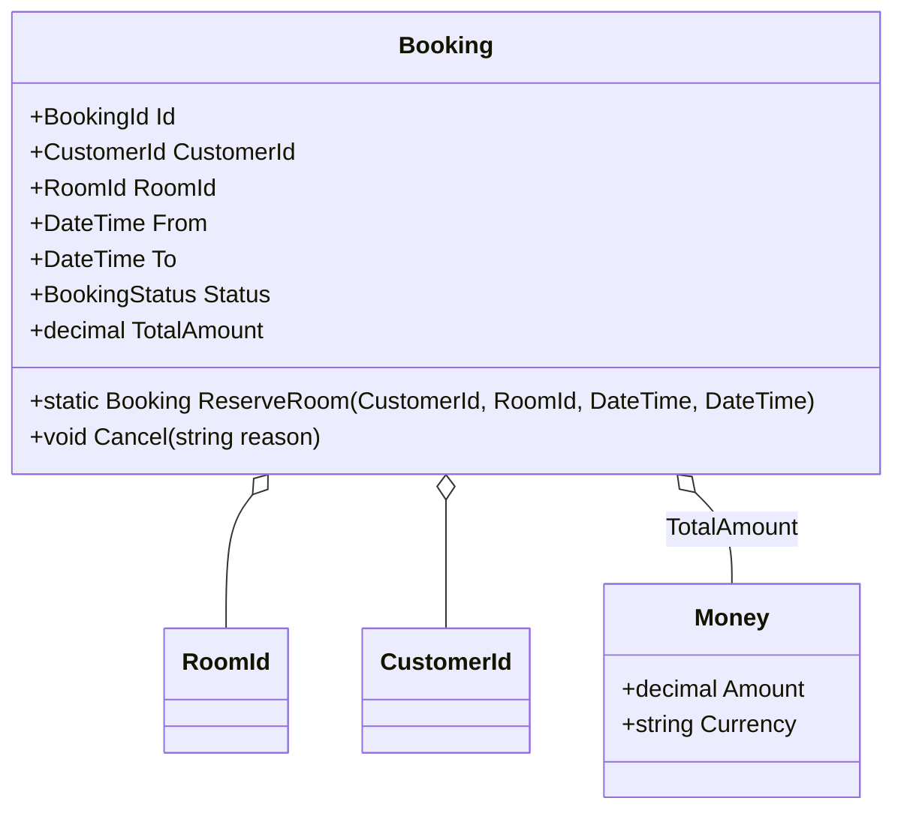
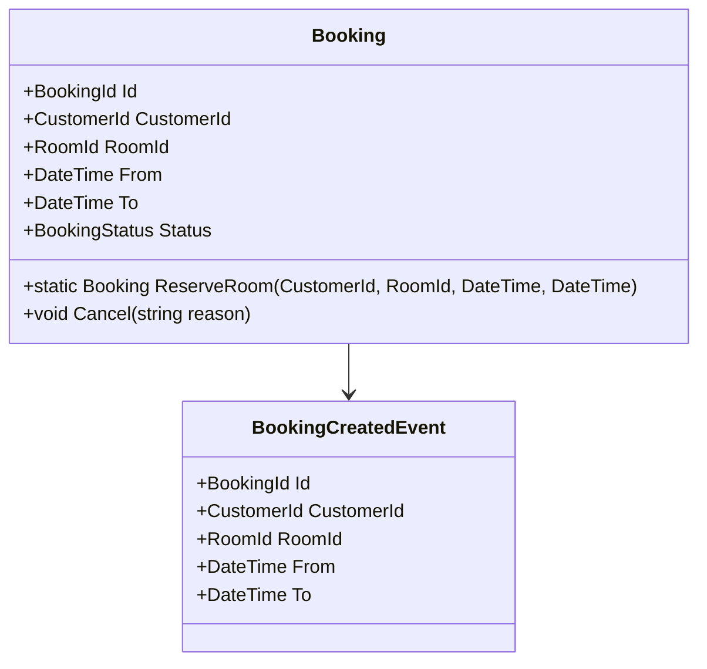
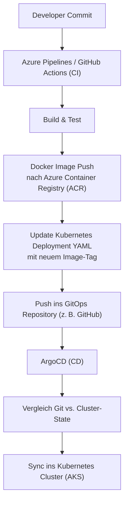

# Lösung Technical Assessment – Senior Entwickler (.NET / Azure)

## Aufgabe 1: Architektur & Domain Design – Monolith zu Microservices

### Teil A – Microservice-Architekturentwurf

#### 1. Aufteilung in Microservices

| Microservice                 | Verantwortlichkeiten                                              |
| ---------------------------- | ----------------------------------------------------------------- |
| **Customer Service**         | Verwaltung von Kundendaten (Anlegen, Ändern, Abfragen)            |
| **Room Service**             | Verwaltung von Zimmern (Verfügbarkeit, Eigenschaften)             |
| **Booking Service**          | Erstellen und Verwalten von Buchungen                             |
| **Payment Service**          | Abwicklung von Zahlungen (Überweisung, Kreditkarte, etc.)         |
| **Invoice Service**          | Erstellen und Versenden von Rechnungen                            |
| **Notification Service**     | Versand von E-Mails/SMS (Buchungsbestätigung, Zahlungserinnerung) |
| **Auth Service**             | Authentifizierung, Token-Ausgabe, Login-Prozesse                  |

**Begründung:** Jeder Service kapselt eine fachliche Kernfunktion und isoliert Zuständigkeiten, was unabhängige Deployments und Skalierung ermöglicht.



#### 2. Kommunikation zwischen Services

Das folgende Sequenzdiagramm stellt den vollständigen Kommunikationsfluss vom Benutzer bis hin zum Versand der Rechnung dar. Es kombiniert synchrone REST-Aufrufe mit asynchronem Event-basierten Messaging.

* **Schritte 1–5:** Der Benutzer tätigt eine Buchung über das Frontend. Das System überprüft die Zimmerverfügbarkeit synchron und erstellt eine Buchung.

* **Schritt 6:** Nach erfolgreicher Buchung wird ein `BookingCreated`-Event gesendet.

* **Schritte 7–8:** Der Payment Service verarbeitet das Event und startet den Bezahlprozess.

* **Schritt 9:** Nach erfolgreicher Zahlung wird ein `PaymentCompleted`-Event versendet.

* **Schritte 10–12:** Der Invoice Service erzeugt die Rechnung basierend auf Booking- und Kundendaten.

* **Schritte 13–14:** Die Rechnung wird über den Notification Service an den Kunden verschickt.

* **REST** für synchrone Abfragen (z. B. Kundenservice → Buchungsservice)

* **AMQP Messaging** (z. B. RabbitMQ oder Azure Service Bus) für asynchrone Events



#### 3. Datenkonsistenz

* **SAGA Pattern (Choreography)**

  * Jeder Service führt lokale Transaktion aus und publiziert Events
  * Kompensation bei Fehlern (z. B. `BookingCancelled` wenn Zahlung fehlschlägt)
* **Outbox Pattern**

  * Speicherung von Events in einer Outbox-Tabelle innerhalb derselben DB-Transaktion wie die Geschäftsdaten
  * Separater Publisher-Prozess liest Outbox aus und sendet Events zuverlässig
  * Markierung oder Löschung versendeter Events zur Vermeidung von Doppelsendungen
* **Idempotente Verarbeitung**

  * Event-Konsumenten müssen mehrfaches Eintreffen eines Events erkennen und korrekt behandeln
  * Verhindert doppelte Aktionen (z. B. doppelte Zahlungen)

#### 4. Infrastruktur-Komponenten

* **API Gateway:** Azure API Management für Routing, Authentifizierung, Throttling
* **Service Registry:** Azure Service Fabric oder Consul für Service Discovery und Load Balancing
* **Message Broker:** Azure Service Bus oder RabbitMQ für asynchrone Kommunikation
* **Configuration Management:** Azure App Configuration für zentrale Einstellungen
* **Monitoring & Tracing:** Azure Application Insights und Log Analytics (OpenTelemetry) für verteiltes Tracing, Metriken und Log-Auswertung
* **Secrets Management:** Azure Key Vault für sichere Speicherung und Rotation von Schlüsseln und Zertifikaten

#### 5. Authentifizierung & Autorisierung

Ein zentrales Authentifizierungs- und Autorisierungskonzept ist entscheidend für die Sicherheit der Microservice-Landschaft. Ziel ist es, Authentifizierung zentralisiert zu halten, während Autorisierung dezentral in jedem Service geprüft wird.

* **Identity Provider:** Azure AD B2C, IdentityServer4 oder Azure AD

  * Zuständig für Benutzerverwaltung, Login, Passwort-Reset, Token-Ausstellung.

* **OAuth2 / OpenID Connect:**

  * Für Autorisierung und Authentifizierung mit Access Tokens (z. B. JWT).
  * Token enthalten Claims (z. B. User-ID, Rollen, Scopes), die von den Microservices interpretiert werden können.

* **API Gateway:**

  * Validiert eingehende JWT-Tokens (Signatur, Ablaufzeit, Issuer)
  * Leitet Anfragen nur bei gültigen Tokens an nachgelagerte Services weiter
  * Optional: Weitergabe von Claims als HTTP-Headers an die Microservices

* **RBAC (Role-Based Access Control):**

  * Jeder Microservice prüft selbstständig die erforderlichen Berechtigungen auf Basis der übermittelten Claims.
  * Beispiel: `BookingService` erlaubt Buchung nur mit Rolle `Customer`, `InvoiceService` nur mit Rolle `Admin` Zugriff auf Rechnungsdaten.

* **Zero-Trust-Prinzip:**

  * Jeder Microservice vertraut niemals blind auf interne Anfragen
  * Validierung und Prüfung erfolgen unabhängig pro Service

* **Token-Gültigkeit und Refresh:**

  * Access Token haben kurze Lebensdauer
  * Refresh Tokens ermöglichen erneute Authentifizierung ohne erneuten Login

* **Single Sign-On (SSO):**

  * Für User-Experience über mehrere Frontends hinweg (z. B. Web + Mobile)

* **Security Best Practices:**

  | Feature                     | Umsetzung                                                |
  | --------------------------- | -------------------------------------------------------- |
  | JWT Validierung             | Am Gateway & in jedem Service (Signatur, Ablauf, Issuer) |
  | Rollenbasierte Prüfung      | Rollen im Token prüfen (z. B. `ROLE_ADMIN`, `ROLE_USER`) |
  | Scope-basiertes Access Mgmt | Zugriff granular pro Endpunkt erlauben                   |
  | Tokenverschlüsselung        | Über TLS (HTTPS) & optional JWE (verschlüsselte JWTs)    |
  | Logging & Auditing          | Zugriff & Fehlversuche zentral protokollieren            |

---

### Teil B – Domain Design: Buchungsservice

#### 1. Wichtige Entities, Value Objects und Aggregate Root



* **Aggregate Root:** `Booking`
* **Entities:** `Booking`
* **Value Objects:** `RoomId`, `CustomerId`, `Money`

#### 2. Domain Events

* `BookingCreated(BookingId, CustomerId, RoomId, From, To)`
* `BookingCancelled(BookingId, Reason)`
* `BookingConfirmed(BookingId)`

#### 3. Use Case / Command Handler Beispiel

```csharp
public class CreateBookingCommand {
    public Guid CustomerId { get; }
    public Guid RoomId { get; }
    public DateTime From { get; }
    public DateTime To { get; }
}

public class CreateBookingHandler {
    private readonly IBookingRepository _repo;
    private readonly IMessageBus _bus;

    public CreateBookingHandler(IBookingRepository repo, IMessageBus bus) {
        _repo = repo;
        _bus = bus;
    }

    public async Task Handle(CreateBookingCommand cmd) {
        var booking = Booking.ReserveRoom(cmd.CustomerId, cmd.RoomId, cmd.From, cmd.To);
        await _repo.AddAsync(booking);
        await _bus.Publish(new BookingCreated(booking.Id, cmd.CustomerId, cmd.RoomId, cmd.From, cmd.To));
    }
}
```

#### 4. UML-Klassendiagramm



---

## Aufgabe 2: Cloud & DevOps – Bereitstellung in Azure

### 1. Azure-Dienste

* **Container-Orchestrierung:** Azure Kubernetes Service (AKS)
* **Serverless:** Azure Functions (z. B. für Benachrichtigungen)
* **Datenbanken:** Azure SQL Database (relationale Daten), Cosmos DB (Dokumente/Audit Logs)
* **Cache:** Azure Cache for Redis
* **Messaging:** Azure Service Bus
* **API Gateway:** Azure API Management
* **Storage:** Azure Blob Storage (Backups, Invoice-PDFs)

### 2. CI/CD-Implementierung



* **Code-Repository:** GitHub oder Azure Repos
* **Pipelines:** Azure DevOps Pipelines oder GitHub Actions

  1. **Build:** Kompilierung, Unit Tests, Docker-Image erstellen
  2. **Push:** Image in Azure Container Registry
  3. **IaC:** Deployment via Terraform oder Bicep
  4. **Deploy:** Helm-Charts in AKS / ARM-Templates
* **GitOps:** ArgoCD für deklarative Deployments

### 3. Monitoring, Logging und Alerting

Eine effektive Überwachung und Analyse ist unerlässlich für Betrieb, Fehlersuche und SLA-Erfüllung. Die folgenden Komponenten bilden das Observability-Fundament:

* **Application Insights:**

  * Tracing einzelner HTTP- und Service-Aufrufe
  * Live Metrics, Performance-Messungen und Verfügbarkeits-Tests
  * Integration mit .NET SDK für automatische Telemetrieerfassung

* **Azure Monitor & Log Analytics:**

  * Zentrale Sammlung und Abfrage von Logs
  * Unterstützung für strukturierte Abfragen mit Kusto Query Language (KQL)
  * Visualisierung über Workbooks oder Dashboards

* **Alerting:**

  * Schwellenwert-basierte Alarme auf Metriken (z. B. CPU, Fehlerquote)
  * Log-basierte Alarme (z. B. Fehler in Applikationslogs)
  * Anbindung an E-Mail, Teams, SMS oder ITSM-Systeme

* **Dashboards:**

  * Eigene Azure Dashboards pro Umgebung/Service
  * Darstellung von KPIs, Response-Times, Error Rates etc.
  * Kombinierbar mit Application Map zur Visualisierung von Abhängigkeiten

* **Application Insights:** Distributed Tracing, Metriken, Live Metrics Stream

* **Azure Monitor:** Log Analytics Workspace für zentrale Log-Sammlung

* **Alerts:** Definition von Metrik- und Log-basierten Alerts in Azure Monitor

* **Dashboards:** Individuelle Azure Dashboards für System- und Business-KPIs

### 4. Skalierbarkeit, Ausfallsicherheit & Wartbarkeit

Ein robustes Systemdesign berücksichtigt dynamische Last, Fehlerfälle und Wartbarkeit:

* **Autoscaling:**

  * Horizontal Pod Autoscaler (HPA) skaliert einzelne Services auf CPU/Last
  * Cluster Autoscaler passt Node-Anzahl automatisch an

* **Multi-Region-Deployment:**

  * Aktive/Passive-Strategie mit Azure Traffic Manager
  * Disaster Recovery durch Georedundanz und Datenbank-Replikation
  * Zentrales Backup z. B. über Azure Backup oder blobbasiert

* **Deployment-Strategien:**

  * **Rolling Updates:** Standardstrategie mit geringer Downtime
  * **Blue/Green Deployment:** Zwei parallele Umgebungen, sicheres Umschalten
  * **Canary Releases:** Teilweise Freigabe für bestimmte Nutzergruppen zur Risikominimierung

* **Fehlertoleranz & Resilienz:**

  * Retry-Strategien, Circuit Breaker (z. B. Polly in .NET)
  * Graceful Degradation (Fallback-Verhalten bei Ausfall)
  * Timeouts, Bulkheads zur Isolierung von Fehlerdomänen

* **Chaos Engineering:**

  * Absichtliches Einführen von Fehlern mit Azure Chaos Studio
  * Prüfung auf Robustheit bei realistischen Störungen

* **Wartbarkeit & Transparenz:**

  * Dokumentation über OpenAPI (Swagger)
  * Tracing, Logzugriff und Metriken für DevOps
  * SLA-Dokumentation, Incident Response Prozesse

* **Autoscaling:** Horizontal Pod Autoscaler & Cluster Autoscaler in AKS

* **Multi-Region-Deployment:** Aktive Region + Passiver DR-Standby (Read Replica)

* **Deployments:** Rolling Updates, Blue/Green oder Canary Releases via Helm

* **Resilienz:** Circuit Breaker & Retry Policies (z. B. mit Polly)

* **Chaos Engineering:** Azure Chaos Studio für Ausfalltests

* **Dokumentation & SLA:** OpenAPI-Spezifikationen, service level agreements

---
