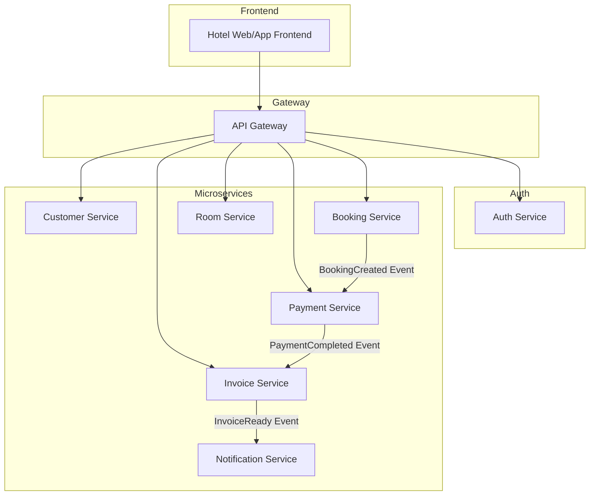
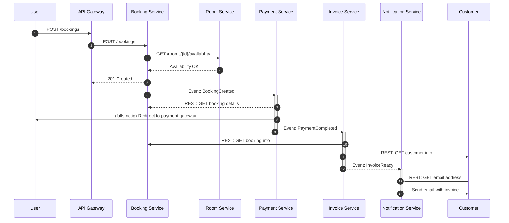
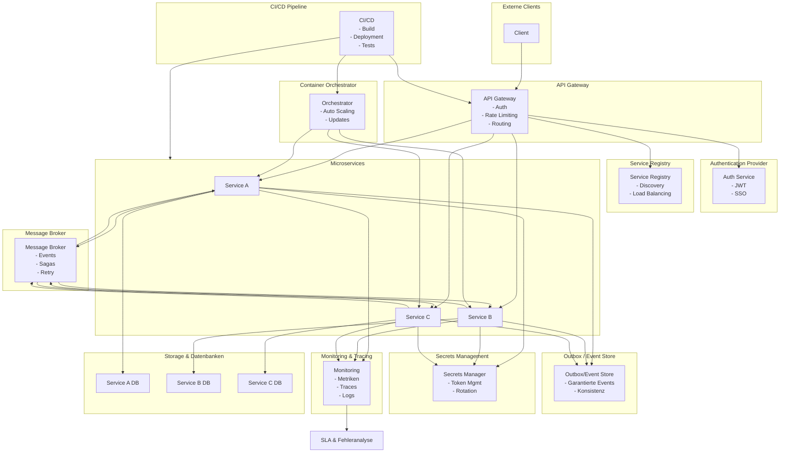

# Microservices und ihre Zuständigkeiten

## 1. Customer Service

- **Zuständigkeit:**
  - Kundenprofile, Kontaktdaten, Registrierung
  - Ggf. Login-Verbindung mit Auth Service

- **Begründung:**
  - Kundenverwaltung ist ein klar abgegrenzter Fachbereich.
  - Wird unabhängig von Buchung oder Zahlung genutzt (z. B. Kundenprofil bearbeiten).
  - Ermöglicht datenschutzkonforme Verarbeitung (z. B. DSGVO-Löschung).

---

## 2. Booking Service

- **Zuständigkeit:**
  - Buchung von Zimmern, Reservierung
  - Check-in/Check-out, Stornierungen

- **Begründung:**
  - Kerndomäne des Systems (zentrale Geschäftslogik).
  - Starke fachliche Trennung von Kunden- und Zahlungsdaten.
  - Änderungen (z. B. Umbuchung, Regeln) sollen unabhängig testbar sein.

---

## 3. Room Service

- **Zuständigkeit:**
  - Verwaltung von Zimmern, Kategorien, Ausstattung
  - Verfügbarkeiten

- **Begründung:**
  - Zimmerdaten sind referenziert, aber unabhängig von Buchungen (z. B. Zimmer-Upgrades).
  - Ermöglicht separate Pflege durch Hotel-Backoffice ohne Logik in Booking.
  - Kapselt Zimmerverwaltung für Re-Use (z. B. in Hotelverwaltungssystemen).

---

## 4. Payment Service

- **Zuständigkeit:**
  - Zahlungsabwicklung, Rückerstattung
  - Zahlungsmethoden (z. B. Kreditkarte, PayPal)

- **Begründung:**
  - Sicherheitstechnisch und regulatorisch (PCI-DSS) kritisch – gehört isoliert.
  - Oft mit externen Providern gekoppelt (Stripe, Adyen).
  - Muss besonders fehlerresilient und nachvollziehbar (Auditing) sein.

---

## 5. Invoice Service

- **Zuständigkeit:**
  - Rechnungserzeugung, steuerliche Berechnung
  - Rechnungsversand

- **Begründung:**
  - Unterschiedliche steuerliche Logik (z. B. Länderabhängigkeit).
  - PDF-Generierung, Versand und Archivierung sind eigene Verantwortlichkeiten.
  - Kann Trigger von Zahlung oder Buchung benötigen – spricht für Event-Handling.

---

## 6. Notification Service

- **Zuständigkeit:**
  - E-Mail- und SMS-Versand für Buchungsbestätigungen, Rechnungen etc.

- **Begründung:**
  - Reine Infrastrukturkomponente.
  - Ermöglicht lose Kopplung zu anderen Services durch asynchrone Events.
  - Kann einfach skalieren und durch externe Provider ersetzt werden (z. B. SendGrid).

---

## 7. Auth Service

- **Zuständigkeit:**
  - Authentifizierung (z. B. OAuth2), Token-Ausgabe, Login-Prozesse

- **Begründung:**
  - Trennung von fachlichen Daten (Customer) und sicherheitsrelevanter Authentifizierung.
  - Wiederverwendbar für interne Tools, Admin-Oberfläche etc.
  - Bei Bedarf an externe Identity Provider auslagerbar.

- **Anmerkung:**
  - Der Auth Service wurde außerhalb des Microservices-Blocks dargestellt, da dieser Service eine besondere Rolle als Infrastruktur- und Security-Komponente spielt und meist an externe Systeme wie Auth0 oder Azure AD delegiert wird.

<h1>Kommunikation der Services</h1>

## Schritt 1–3: User bucht über API

- **Aktion:** Der Benutzer sendet über die Web- oder Mobile-App eine Buchungsanfrage.
- **Kommunikationstyp:** REST (HTTP)
- **Begründung:**
  - Dies ist eine synchrone Benutzerinteraktion: Der User erwartet eine unmittelbare Rückmeldung (z. B. ob die Buchung erfolgreich war).
  - REST ist einfach zu implementieren und eignet sich gut für CRUD-Operationen im Frontend-Kontext.

---

## Schritt 4: Verfügbarkeit prüfen

- **Aktion:** Der Booking Service fragt beim Room Service an, ob das gewünschte Zimmer verfügbar ist.
- **Kommunikationstyp:** REST (HTTP)
- **Begründung:**
  - Die Verfügbarkeit muss in Echtzeit synchron geprüft werden, da der Buchungsprozess nicht ohne diese Information fortgesetzt werden kann.
  - Der Room Service ist zuständig für Live-Zimmerdaten, und REST ermöglicht einfache und schnelle Punkt-zu-Punkt-Kommunikation.

---

## Schritt 5: Buchung gespeichert

- **Aktion:** Der Booking Service speichert die Buchung und bestätigt sie dem User.
- **Kommunikationstyp:** REST
- **Begründung:**
  - Die Bestätigung der Buchung ist Teil des initialen synchronen API-Aufrufs.
  - Eine sofortige Rückmeldung ist erforderlich, um dem User eine klare Reaktion zu geben (z. B. "Ihre Buchung war erfolgreich").

---

## Schritt 6: Event `BookingCreated`

- **Aktion:** Der Booking Service sendet ein Event mit der Buchungs-ID an den Message Broker.
- **Kommunikationstyp:** Eventing (asynchron)
- **Begründung:**
  - Die Zahlung muss nicht sofort erfolgen, sondern kann nachgelagert und unabhängig erfolgen.
  - Durch asynchrone Event-Kommunikation wird der Booking Service nicht blockiert und kann sofort andere Buchungen annehmen.

---

## Schritt 7–8: Zahlung wird verarbeitet

- **Aktion:** Der Payment Service empfängt das `BookingCreated`-Event, startet ggf. den Bezahlprozess (z. B. Weiterleitung zu Stripe/PayPal).
- **Kommunikationstyp:** REST + Eventing
- **Begründung:**
  - Der Eventempfang ist asynchron (Eventing), aber die Bezahllogik (z. B. Redirect, Payment Gateway) erfordert synchrones Verhalten (REST).
  - Die Kombination beider Methoden ermöglicht technische Flexibilität und Benutzerinteraktion.

---

## Schritt 9: Event `PaymentCompleted`

- **Aktion:** Nach erfolgreicher Zahlung sendet der Payment Service ein Event, das den nächsten Prozess auslöst.
- **Kommunikationstyp:** Eventing (asynchron)
- **Begründung:**
  - Die Rechnung muss nicht in Echtzeit erzeugt werden.
  - Ein asynchrones Event stellt sicher, dass der Invoice Service entkoppelt vom Zahlungsvorgang ist und bei Bedarf horizontal skaliert werden kann.

---

## Schritt 10–12: Rechnung wird erzeugt

- **Aktion:** Der Invoice Service empfängt das Event `PaymentCompleted`, ruft nötige Daten ab (z. B. Buchung, Kundendaten), generiert die Rechnung und sendet ein Event `InvoiceReady`.
- **Kommunikationstyp:** REST + Eventing
- **Begründung:**
  - Für die Rechnung werden detaillierte Daten benötigt (z. B. Buchungsdetails, Steuerinformationen).
  - Diese werden synchron über REST vom Booking- und Customer Service abgefragt.
  - Danach wird durch Eventing (`InvoiceReady`) die Benachrichtigung eingeleitet – lose Kopplung & Erweiterbarkeit.

---

## Schritt 13–14: Rechnung wird versendet

- **Aktion:** Der Notification Service erhält das Event `InvoiceReady`, holt sich die E-Mail-Adresse und versendet die Rechnung.
- **Kommunikationstyp:** REST
- **Begründung:**
  - Der Versand ist automatisiert, muss aber die korrekten Empfängerdaten synchron vom Customer Service abrufen.
  - Durch REST kann sich der Notification-Service aktuelle Kundendaten holen, ohne diese dauerhaft zu speichern (→ Datenschutz, DSGVO).

<h1>Datenkonsistenz zwischen Buchung und Zahlung</h1>

Ansteller einer zentrale Transaktion kann man die Konsistenz zwischen Booking und Payment durch durch
> Verteilte, robuste Eventverarbeitung
> Klare Zustandsübergänge via Domain Events
> Resiliente Wiederholbarkeit
sichergestellt werden.

Ziel ist eine skalierbare, ausfallsichere und konsistente Architektur, ohne die Nachteile klassischer, starrer Transaktionsmodelle.
Errecht wird dies durch die verwendung folgender pattern:

## 1. Saga Pattern

Die **Buchung** und die **Zahlung** bilden gemeinsam eine verteilte Transaktion.

- Jeder Microservice führt nur seine lokale Transaktion aus.
- Nach erfolgreicher Ausführung sendet der Service ein Event.
- Es gibt keinen globalen Transaktionsmanager (z. B. kein Two-Phase Commit).
- Jeder Schritt ist atomar und kommuniziert über asynchrone Events mit den anderen Teilnehmern.

> Vorteil: Hohe Entkopplung der Services und gute Skalierbarkeit durch Event-basierte Kommunikation.

---

## 2. Outbox Pattern – Zuverlässige Event-Zustellung

Beim Schreiben in die Datenbank und dem gleichzeitigen Versenden eines Events kann ein Event verloren gehen, etwa bei einem plötzlichen Absturz des Services.

Das Outbox Pattern verhindert dieses Problem durch:

- Speichern des Events in einer Outbox-Tabelle in derselben Datenbank-Transaktion wie die Geschäftsdaten.
- Ein separater Prozess (z. B. Event Publisher) liest die Outbox regelmäßig aus und versendet Events zuverlässig.
- Gesendete Events werden z. B. durch ein Flag markiert oder gelöscht – Doppelsendungen werden vermieden.

> Vorteil: Zuverlässige Zustellung ohne Dateninkonsistenzen – die Event-Publikation ist eng mit der Buchung verknüpft.

---

## 3. Idempotenz – Wiederholbarkeit sicherstellen

Alle Event-Konsumenten (z. B. der Payment Service) müssen idempotent implementiert sein:

- Ein Event kann aus verschiedenen Gründen mehrfach ankommen.
- Die Verarbeitung darf keine unerwünschten Seiteneffekte erzeugen – selbst wenn das Event doppelt oder mehrfach verarbeitet wird.

> Beispiel: Eine Zahlung darf nicht zweimal ausgelöst werden, wenn das Event zweimal verarbeitet wird.

---

# Infrastrukturkomponenten

## API Gateway

- **Funktion:** Zentrale Schnittstelle für externe Clients
- **Details:**
  - Bündelt alle REST-Endpunkte
  - Setzt Authentifizierung, Rate Limiting und Routing um

---

## Service Registry

- **Funktion:** Verzeichnis für verfügbare Services
- **Details:**
  - Ermöglicht dynamisches Service Discovery & Load Balancing
  - Unterstützt Resilienz und horizontale Skalierung

---

## Message Broker

- **Funktion:** Asynchrone Kommunikation & Eventing
- **Details:**
  - Ermöglicht lose Kopplung zwischen Services
  - Unterstützt Sagas, Events & Retry-Mechanismen

---

## Outbox System / Event Store

- **Funktion:** Garantierte Event-Zustellung
- **Details:**
  - Verhindert Eventverlust bei Serviceabstürzen
  - Garantiert Konsistenz zwischen Datenbankoperationen und Events

---

## Authentication Provider

- **Funktion:** Authentifizierung & Token-Handling
- **Details:**
  - Zentrale User-Identität und Single Sign-On (SSO)
  - Liefert JWTs für Zugriffskontrolle auf Services

---

## Secrets Management

- **Funktion:** Sichere Verwaltung von Passwörtern, Tokens etc.
- **Details:**
  - Verhindert hartcodierte Geheimnisse
  - Ermöglicht zentrale Rotation und Zugriffskontrolle

---

## Monitoring & Tracing

- **Funktion:** Überwachung & Fehlerdiagnose
- **Details:**
  - Erfasst Metriken, Logs und verteilte Traces
  - Unterstützt SLA-Einhaltung und Ursachenanalyse

---

## Container Orchestrator

- **Funktion:** Deployment, Skalierung, Isolation von Services
- **Details:**
  - Führt Microservices containerisiert aus
  - Ermöglicht Auto-Scaling, Self-Healing und Rolling Updates

---

## CI/CD Pipeline

- **Funktion:** Automatisierter Build & Deployment
- **Details:**
  - Sichert schnelle, wiederholbare Auslieferung
  - Unterstützt Rollbacks & automatisierte Tests

---

## Storage & Datenbanken

- **Funktion:** Persistente Datenspeicherung pro Service
- **Details:**
  - Jeder Service besitzt eine eigene Datenbank ("Database per Service")
  - Ermöglicht gezielte Optimierung und Datenisolation
