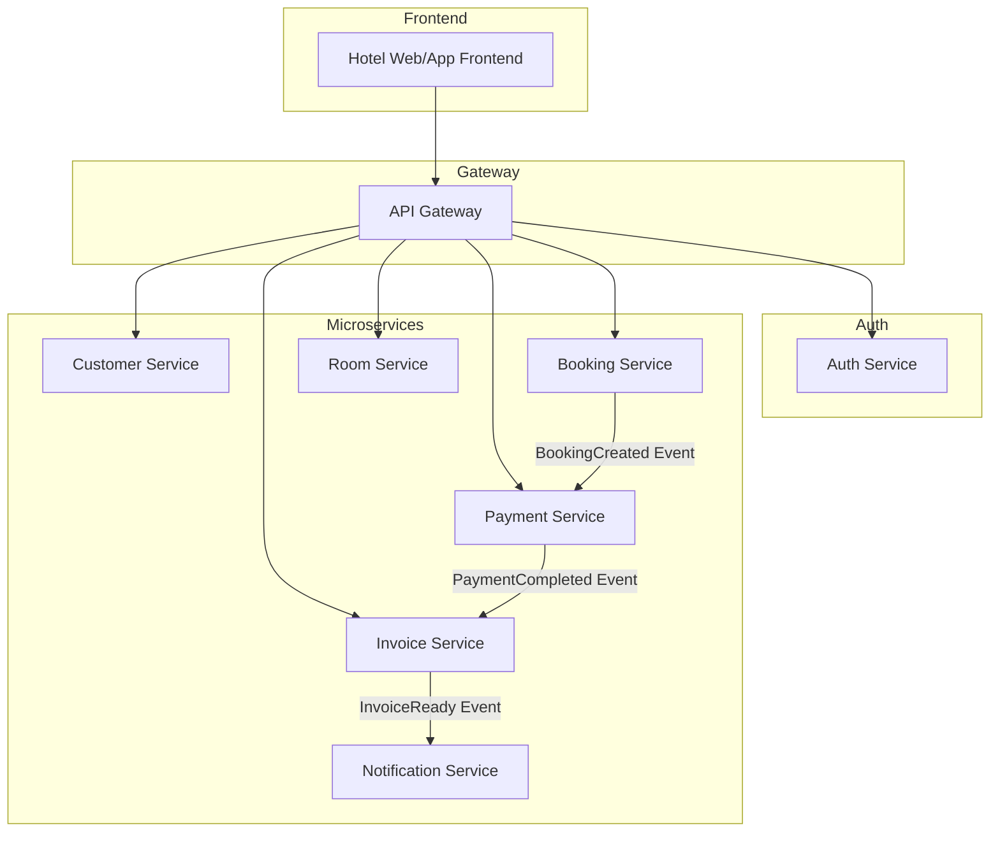
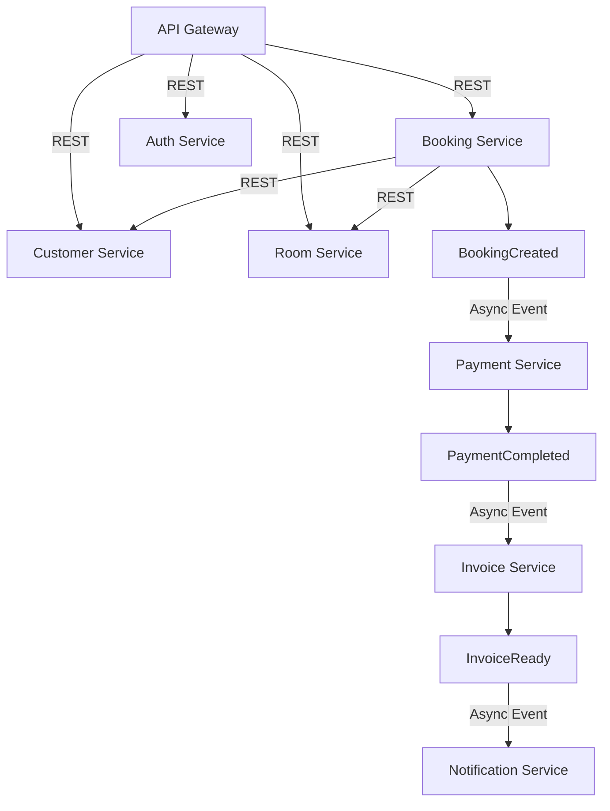

1. Customer Service  
- Zuständigkeit:  
> Kundenprofile, Kontaktdaten, Registrierung, ggf. Login-Verbindung mit Auth.  
- Begründung:  
> Kundenverwaltung ist ein klar abgegrenzter Fachbereich.  
> Wird unabhängig von Buchung oder Zahlung genutzt (z. B. Kundenprofil bearbeiten).  
> Ermöglicht Datenschutzkonforme Verarbeitung (z. B. DSGVO-Löschung).  

2. Booking Service  
- Zuständigkeit:  
> Buchung von Zimmern, Reservierung, Check-in/out, Stornierungen.  
- Begründung:  
> Kerndomäne des Systems (zentrale Geschäftslogik).  
> Starke fachliche Trennung von Kunden- und Zahlungsdaten.  
> Änderungen (z. B. Umbuchung, Regeln) sollen unabhängig testbar sein.  

3. Room Service  
- Zuständigkeit:  
> Verwaltung von Zimmern, Kategorien, Ausstattung, Verfügbarkeiten.  
- Begründung:  
> Zimmerdaten sind referenziert, aber unabhängig von Buchungen (z. B. Zimmer-Upgrades).  
> Ermöglicht separate Pflege durch Hotel-Backoffice ohne Logik in Booking.  
> Kapselt Zimmerverwaltung für Re-use (z. B. in Hotelverwaltungssystemen).  

4. Payment Service  
- Zuständigkeit:  
> Zahlungsabwicklung, Rückerstattung, Zahlungsmethoden (z. B. Kreditkarte, PayPal).  
- Begründung:  
> Sicherheitstechnisch und regulatorisch (PCI-DSS) kritisch – gehört isoliert.  
> Oft mit externen Providern gekoppelt (Stripe, Adyen).  
> Muss besonders fehlerresilient und nachvollziehbar (Auditing) sein.  

5. Invoice Service  
- Zuständigkeit:  
> Rechnungserzeugung, steuerliche Berechnung, Rechnungsversand.  
- Begründung:  
> Unterschiedliche steuerliche Logik (z. B. Länderabhängigkeit).  
> PDF-Generierung, Versand und Archivierung sind eigene Verantwortlichkeiten.  
> Kann Trigger von Zahlung oder Buchung benötigen – spricht für Event-Handling.  

6. Notification Service  
- Zuständigkeit:  
> E-Mail- und SMS-Versand für Buchungsbestätigungen, Rechnungen etc.  
- Begründung:  
> Reine Infrastrukturkomponente.  
> Ermöglicht lose Kopplung zu anderen Services durch asynchrone Events.  
> Kann einfach skalieren und durch externe Provider ersetzt werden (z. B. SendGrid).  

8. Auth Service  
- Zuständigkeit:  
> Authentifizierung (z. B. OAuth2), Token-Ausgabe, Login-Prozesse.  
- Begründung:  
> Trennung von fachlichen Daten (Customer) und sicherheitsrelevanter Authentifizierung.  
> Wiederverwendbar für interne Tools, Admin-Oberfläche etc.  
> Bei Bedarf an externe Identity Provider auslagerbar.  
- Anmerkungen:   
> Den Auth Service habe ich ausßerhalb des Microservices Block dargestellt da dieser Service eine besondere Rolle als Infrastruktur- und Security-Komponente darstellt und meist an externe Systeme wie Aurth0 oder Azure AD delegiert wird.

<h2>Kommunikation der Services</h2>

1. API Gateway → Microservices  
- REST (HTTP):  
> Externe Clients (Web/Apps) erwarten schnelle, synchrone Antworten (z. B. Buchung abschicken, Rechnungs-PDF anzeigen).  
> Einfach, transparent, geeignet für lesende Operationen.  

2. Booking Service ↔ Room Service  
- REST (synchron):  
> Bei einer Buchung muss die aktuelle Verfügbarkeit eines Zimmers geprüft werden (z. B. GET /rooms/{id}/availability).  
> Enge zeitliche Kopplung erforderlich – synchroner Zugriff sinnvoll.  
> Caching auf Booking-Seite möglich, um REST-Aufrufe zu minimieren.  

3. Booking Service → Payment Service  
- Eventing (asynchron, über Message Broker):  
> z. B. Event BookingCreated  
> Buchung erzeugt Event, Zahlung erfolgt asynchron (User muss evtl. noch bezahlen).  
> Loose Coupling, keine Wartezeit nötig.  
> Technologien: Azure Service Bus, RabbitMQ, Apache Kafka  

4. Payment Service → Invoice Service  
- Eventing (asynchron):  
> z. B. Event PaymentCompleted  
> Die Rechnung wird nach erfolgreicher Zahlung erzeugt.  
> Lose Kopplung, leicht zu erweitern (z. B. weitere Services wie Loyalty Points hinzufügen).  
> Resilient gegen temporäre Ausfälle (z. B. Invoice-Queue puffert Event).  

5. Invoice Service → Notification Service  
- Messaging (asynchron):  
> Rechnung wurde erzeugt → E-Mail mit Anhang versenden.  
> Kein Rückgabewert nötig, Entkopplung erhöht Resilienz.  

6. Customer Service ↔ Booking/Payment  
- REST oder Eventing:  
> REST: GET /customers/{id} → Daten abrufen  
> Eventing: CustomerDeleted → Storniere alle offenen Buchungen  
> CRUD-Anfragen synchron, systemische Änderungen (z. B. Löschung) über Eventing  

7. Auth Service  
- REST (synchron) – nur mit API Gateway:  
> Authentifizierung muss direkt und zuverlässig beim Login erfolgen.  
> JWT-Token-Verifikation erfolgt im API Gateway, Services verifizieren ggf. Signatur lokal (kein erneuter Aufruf nötig → Performance).  

<h2> Beispiel </h2>

User → API Gateway → POST /booking

1. Booking Service:
> prüft Zimmerverfügbarkeit via REST → Room Service  
> speichert Buchung lokal  
> sendet Event `BookingCreated`

2. Payment Service:
> empfängt Event `BookingCreated`  
> startet Bezahlprozess  
> bei Erfolg: sendet Event `PaymentCompleted`

3. Invoice Service:
> empfängt Event `PaymentCompleted`  
> erzeugt Rechnung  
> sendet Event `InvoiceReady`

4. Notification Service:
> empfängt Event `InvoiceReady`  
> versendet E-Mail mit PDF
