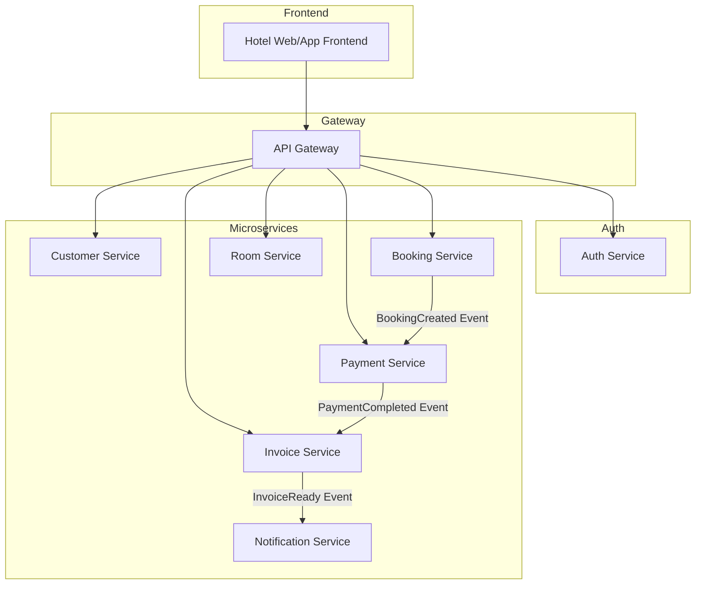
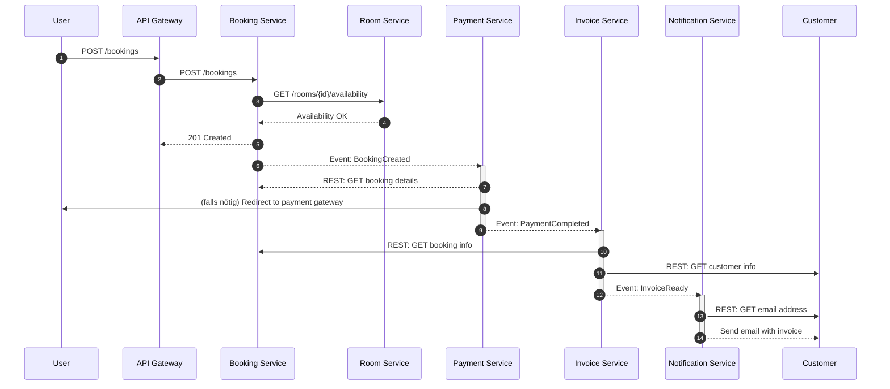

## Aufgabe 1: Architektur & Domain Design – Monolith zu Microservices

### Teil A – Microservice-Architekturentwurf

#### 1. Aufteilung in Microservices

| Microservice                 | Verantwortlichkeiten                                              |
| ---------------------------- | ----------------------------------------------------------------- |
| **Customer Service**         | Verwaltung von Kundendaten (Anlegen, Ändern, Abfragen)            |
| **Room Service**             | Verwaltung von Zimmern (Verfügbarkeit, Eigenschaften)             |
| **Booking Service**          | Erstellen und Verwalten von Buchungen                             |
| **Payment Service**          | Abwicklung von Zahlungen (Überweisung, Kreditkarte, etc.)         |
| **Invoice Service**          | Erstellen und Versenden von Rechnungen                            |
| **Notification Service**     | Versand von E-Mails/SMS (Buchungsbestätigung, Zahlungserinnerung) |
| **Auth Service**             | Authentifizierung, Token-Ausgabe, Login-Prozesse                  |

**Begründung:** Jeder Service kapselt eine fachliche Kernfunktion und isoliert Zuständigkeiten, was unabhängige Deployments und Skalierung ermöglicht.

#### 2. Kommunikation zwischen Services

Das folgende Sequenzdiagramm stellt den vollständigen Kommunikationsfluss vom Benutzer bis hin zum Versand der Rechnung dar. Es kombiniert synchrone REST-Aufrufe mit asynchronem Event-basierten Messaging.

- **Schritte 1–5:** Der Benutzer tätigt eine Buchung über das Frontend. Das System überprüft die Zimmerverfügbarkeit synchron und erstellt eine Buchung.

- **Schritt 6:** Nach erfolgreicher Buchung wird ein `BookingCreated`-Event gesendet.

- **Schritte 7–8:** Der Payment Service verarbeitet das Event und startet den Bezahlprozess.

- **Schritt 9:** Nach erfolgreicher Zahlung wird ein `PaymentCompleted`-Event versendet.

- **Schritte 10–12:** Der Invoice Service erzeugt die Rechnung basierend auf Booking- und Kundendaten.

- **Schritte 13–14:** Die Rechnung wird über den Notification Service an den Kunden verschickt.

- **REST** für synchrone Abfragen (z. B. Kundenservice → Buchungsservice)

- **AMQP Messaging** (z. B. RabbitMQ oder Azure Service Bus) für asynchrone Events

**Hinweis zu konkurrierendem Zugriff und Sperrmechanismen:**

Bei gleichzeitigen Buchungsversuchen für dasselbe Zimmer innerhalb desselben Zeitraums kann es zu Race Conditions kommen. Zur Vermeidung empfiehlt sich:

- **Optimistisches Locking:** Vergleich von Versionen oder Zeitstempeln (z. B. mit `ETag` oder `RowVersion`), um Konflikte zu erkennen.

- **Pessimistisches Locking:** Kurzzeitige Sperre während der Buchung, z. B. durch Transaktion oder Redis-basierte Locks.

- **Eventual Consistency Handling:** Akzeptieren kurzfristiger Inkonsistenzen und nachträgliche Auflösung durch Event-Kompensation.

#### 3. Datenkonsistenz

- **SAGA Pattern (Choreography)**
  - Jeder Service führt lokale Transaktion aus und publiziert Events
  - Kompensation bei Fehlern (z. B. `BookingCancelled` wenn Zahlung fehlschlägt)
- **Outbox Pattern**
  - Speicherung von Events in einer Outbox-Tabelle innerhalb derselben DB-Transaktion wie die Geschäftsdaten
  - Separater Publisher-Prozess liest Outbox aus und sendet Events zuverlässig
  - Markierung oder Löschung versendeter Events zur Vermeidung von Doppelsendungen
- **Idempotente Verarbeitung**
  - Event-Konsumenten müssen mehrfaches Eintreffen eines Events erkennen und korrekt behandeln
  - Verhindert doppelte Aktionen (z. B. doppelte Zahlungen)

#### 4. Infrastruktur-Komponenten

- **API Gateway:** Azure API Management für Routing, Authentifizierung, Throttling
- **Service Registry:** Azure Service Fabric oder Consul für Service Discovery und Load Balancing
- **Message Broker:** Azure Service Bus oder RabbitMQ für asynchrone Kommunikation
- **Configuration Management:** Azure App Configuration für zentrale Einstellungen
- **Monitoring & Tracing:** Azure Application Insights und Log Analytics (OpenTelemetry) für verteiltes Tracing, Metriken und Log-Auswertung
- **Secrets Management:** Azure Key Vault für sichere Speicherung und Rotation von Schlüsseln und Zertifikaten

#### 5. Authentifizierung & Autorisierung

Die Authentifizierungs- und Autorisierungsarchitektur basiert auf dem bewährten **AAA-Prinzip**:

1. **Authentication (Authentifizierung)** – Wer bist du?
2. **Authorization (Autorisierung)** – Was darfst du?
3. **Accounting (Abrechnung/Nachvollziehbarkeit)** – Was hast du getan?

Dieses Prinzip findet sich in allen Ebenen der Architektur wieder – vom API Gateway bis zum einzelnen Microservice.

Ein zentrales Authentifizierungs- und Autorisierungskonzept ist entscheidend für die Sicherheit der Microservice-Landschaft. Ziel ist es, Authentifizierung zentralisiert zu halten, während Autorisierung dezentral in jedem Service geprüft wird.

- **Identity Provider:** Azure AD B2C, IdentityServer4 oder Azure AD

  - Zuständig für Benutzerverwaltung, Login, Passwort-Reset, Token-Ausstellung.

- **OAuth2 / OpenID Connect:**

  - Für Autorisierung und Authentifizierung mit Access Tokens (z. B. JWT).
  - Token enthalten Claims (z. B. User-ID, Rollen, Scopes), die von den Microservices interpretiert werden können.

- **API Gateway:**

  - Validiert eingehende JWT-Tokens (Signatur, Ablaufzeit, Issuer)
  - Leitet Anfragen nur bei gültigen Tokens an nachgelagerte Services weiter
  - Optional: Weitergabe von Claims als HTTP-Headers an die Microservices

- **RBAC (Role-Based Access Control):**

  - Jeder Microservice prüft selbstständig die erforderlichen Berechtigungen auf Basis der übermittelten Claims.
  - Beispiel: `BookingService` erlaubt Buchung nur mit Rolle `Customer`, `InvoiceService` nur mit Rolle `Admin` Zugriff auf Rechnungsdaten.

- **Zero-Trust-Prinzip:**

  - Jeder Microservice vertraut niemals blind auf interne Anfragen
  - Validierung und Prüfung erfolgen unabhängig pro Service

- **Token-Gültigkeit und Refresh:**

  - Access Token haben kurze Lebensdauer
  - Refresh Tokens ermöglichen erneute Authentifizierung ohne erneuten Login

- **Single Sign-On (SSO):**

  - Für User-Experience über mehrere Frontends hinweg (z. B. Web + Mobile)

- **Security Best Practices:**

  | Feature                     | Umsetzung                                                |
  | --------------------------- | -------------------------------------------------------- |
  | JWT Validierung             | Am Gateway & in jedem Service (Signatur, Ablauf, Issuer) |
  | Rollenbasierte Prüfung      | Rollen im Token prüfen (z. B. `ROLE_ADMIN`, `ROLE_USER`) |
  | Scope-basiertes Access Mgmt | Zugriff granular pro Endpunkt erlauben                   |
  | Tokenverschlüsselung        | Über TLS (HTTPS) & optional JWE (verschlüsselte JWTs)    |
  | Logging & Auditing          | Zugriff & Fehlversuche zentral protokollieren            |

