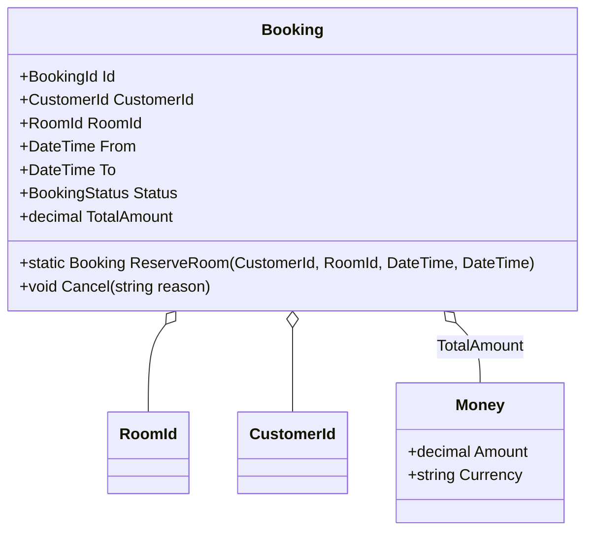
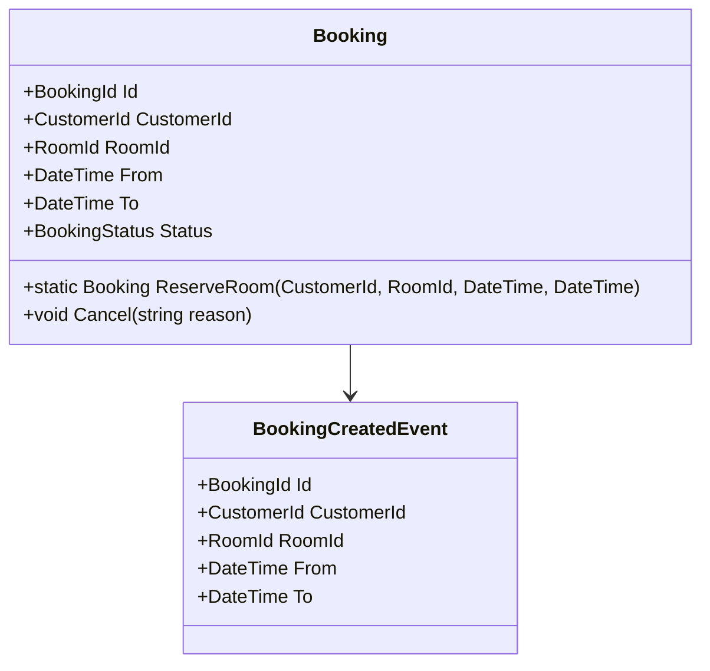

### Teil B – Domain Design: Buchungsservice

#### 1. Wichtige Entities, Value Objects und Aggregate Root



* **Aggregate Root:** `Booking`
* **Entities:** `Booking`
* **Value Objects:** `RoomId`, `CustomerId`, `Money`

#### 2. Domain Events

* `BookingCreated(BookingId, CustomerId, RoomId, From, To)`
* `BookingCancelled(BookingId, Reason)`
* `BookingConfirmed(BookingId)`

#### 3. Use Case / Command Handler Beispiel

```csharp
public class CreateBookingCommand {
    public Guid CustomerId { get; }
    public Guid RoomId { get; }
    public DateTime From { get; }
    public DateTime To { get; }
}

public class CreateBookingHandler {
    private readonly IBookingRepository _repo;
    private readonly IMessageBus _bus;

    public CreateBookingHandler(IBookingRepository repo, IMessageBus bus) {
        _repo = repo;
        _bus = bus;
    }

    public async Task Handle(CreateBookingCommand cmd) {
        var booking = Booking.ReserveRoom(cmd.CustomerId, cmd.RoomId, cmd.From, cmd.To);
        await _repo.AddAsync(booking);
        await _bus.Publish(new BookingCreated(booking.Id, cmd.CustomerId, cmd.RoomId, cmd.From, cmd.To));
    }
}
```

#### 4. UML-Klassendiagramm



---
