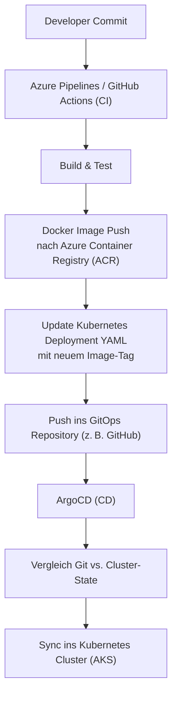

## Aufgabe 2: Cloud & DevOps – Bereitstellung in Azure

### 1. Azure-Dienste

* **Container-Orchestrierung:** Azure Kubernetes Service (AKS)
* **Serverless:** Azure Functions (z. B. für Benachrichtigungen)
* **Datenbanken:** Azure SQL Database (relationale Daten), Cosmos DB (Dokumente/Audit Logs)
* **Cache:** Azure Cache for Redis
* **Messaging:** Azure Service Bus
* **API Gateway:** Azure API Management
* **Storage:** Azure Blob Storage (Backups, Invoice-PDFs)

### 2. CI/CD-Implementierung

* **Code-Repository:** GitHub oder Azure Repos
* **Pipelines:** Azure DevOps Pipelines oder GitHub Actions

  1. **Build:** Kompilierung, Unit Tests, Docker-Image erstellen
  2. **Push:** Image in Azure Container Registry
  3. **IaC:** Deployment via Terraform oder Bicep
  4. **Deploy:** Helm-Charts in AKS / ARM-Templates
* **GitOps:** ArgoCD für deklarative Deployments

### 3. Monitoring, Logging und Alerting

Eine effektive Überwachung und Analyse ist unerlässlich für Betrieb, Fehlersuche und SLA-Erfüllung. Die folgenden Komponenten bilden das Observability-Fundament:

* **Application Insights:**

  * Tracing einzelner HTTP- und Service-Aufrufe
  * Live Metrics, Performance-Messungen und Verfügbarkeits-Tests
  * Integration mit .NET SDK für automatische Telemetrieerfassung

* **Azure Monitor & Log Analytics:**

  * Zentrale Sammlung und Abfrage von Logs
  * Unterstützung für strukturierte Abfragen mit Kusto Query Language (KQL)
  * Visualisierung über Workbooks oder Dashboards

* **Alerting:**

  * Schwellenwert-basierte Alarme auf Metriken (z. B. CPU, Fehlerquote)
  * Log-basierte Alarme (z. B. Fehler in Applikationslogs)
  * Anbindung an E-Mail, Teams, SMS oder ITSM-Systeme

* **Dashboards:**

  * Eigene Azure Dashboards pro Umgebung/Service
  * Darstellung von KPIs, Response-Times, Error Rates etc.
  * Kombinierbar mit Application Map zur Visualisierung von Abhängigkeiten

* **Application Insights:** Distributed Tracing, Metriken, Live Metrics Stream

* **Azure Monitor:** Log Analytics Workspace für zentrale Log-Sammlung

* **Alerts:** Definition von Metrik- und Log-basierten Alerts in Azure Monitor

* **Dashboards:** Individuelle Azure Dashboards für System- und Business-KPIs

### 4. Skalierbarkeit, Ausfallsicherheit & Wartbarkeit

Ein robustes Systemdesign berücksichtigt dynamische Last, Fehlerfälle und Wartbarkeit:

* **Autoscaling:**

  * Horizontal Pod Autoscaler (HPA) skaliert einzelne Services auf CPU/Last
  * Cluster Autoscaler passt Node-Anzahl automatisch an

* **Multi-Region-Deployment:**

  * Aktive/Passive-Strategie mit Azure Traffic Manager
  * Disaster Recovery durch Georedundanz und Datenbank-Replikation
  * Zentrales Backup z. B. über Azure Backup oder blobbasiert

* **Deployment-Strategien:**

  * **Rolling Updates:** Standardstrategie mit geringer Downtime
  * **Blue/Green Deployment:** Zwei parallele Umgebungen, sicheres Umschalten
  * **Canary Releases:** Teilweise Freigabe für bestimmte Nutzergruppen zur Risikominimierung

* **Fehlertoleranz & Resilienz:**

  * Retry-Strategien, Circuit Breaker (z. B. Polly in .NET)
  * Graceful Degradation (Fallback-Verhalten bei Ausfall)
  * Timeouts, Bulkheads zur Isolierung von Fehlerdomänen

* **Chaos Engineering:**

  * Absichtliches Einführen von Fehlern mit Azure Chaos Studio
  * Prüfung auf Robustheit bei realistischen Störungen

* **Wartbarkeit & Transparenz:**

  * Dokumentation über OpenAPI (Swagger)
  * Tracing, Logzugriff und Metriken für DevOps
  * SLA-Dokumentation, Incident Response Prozesse

* **Autoscaling:** Horizontal Pod Autoscaler & Cluster Autoscaler in AKS

* **Multi-Region-Deployment:** Aktive Region + Passiver DR-Standby (Read Replica)

* **Deployments:** Rolling Updates, Blue/Green oder Canary Releases via Helm

* **Resilienz:** Circuit Breaker & Retry Policies (z. B. mit Polly)

* **Chaos Engineering:** Azure Chaos Studio für Ausfalltests

* **Dokumentation & SLA:** OpenAPI-Spezifikationen, service level agreements

---
